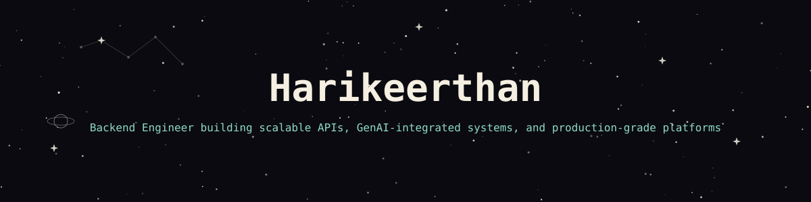

  

  

  

---

### 🛠 Technologies

  

---

### 📌 Featured Work

- **[Bookmydoc](https://github.com/Harikeerthan24-m/Bookmydoc)** — Appointment booking system with real-time scheduling logic
- **Crevolt Tenant Platform** *(private)* — Multi-tenant SaaS platform handling isolated tenant data at scale
- **Tenant Analysis** *(private)* — Analytics engine surfacing usage insights across tenants
- **Slidez** *(private)* — Automation pipeline for AI-driven content generation

  

---

### 📊 Vital Statistics

  

  
  

  

  

---

<table width="100%" border="0" cellspacing="10" cellpadding="0">
<tr>

<td width="50%" valign="top">

<h3>🤝 Open to collaborating on</h3>
<ul>
  <li>Backend / API systems at scale</li>
  <li>LLM &amp; RAG-integrated products</li>
  <li>Automation &amp; data pipelines</li>
  <li>Multi-tenant SaaS architecture</li>
</ul>

</td>

<td width="50%" valign="top" align="center">

<h3>📫 Contact</h3>
 

  

  

</td>

</tr>
</table>

  

⚡ Building backend systems, one scalable API at a time

Star ⭐ the repos if they helped you!

